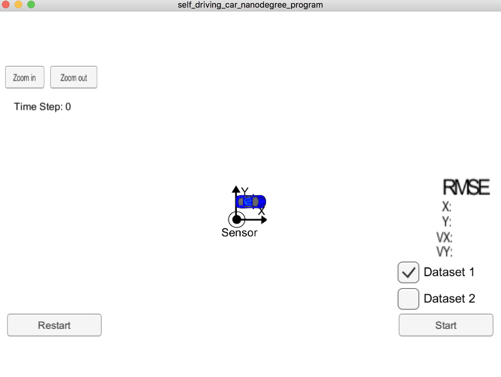

# Self-Driving Car Unscented Kalman Filter -  Part 2
Udacity Self-Driving Car Nanodegree - Unscented Kalman Filter Implementation

# Overview
This project implemented an Unscented Kalman Filter in Self-driving car to track and predict the position of objects around the vehicle. In this project, the UKF system use two sensors data from RADAR and LIDAR measurement for processing UKF. This project used C++ as a programming language because it perform fast and can decrectly interact with the sensors hardware.

# Prerequisites

The project has the following dependencies:

- cmake >= 3.5
- make >= 4.1
- gcc/g++ >= 5.4
- Udacity's simulator.


For instructions on how to install these components on different operating systems, please, visit [Udacity's seed project](https://github.com/udacity/CarND-Unscented-Kalman-Filter-Project). As this particular implementation was done on Mac OS, the rest of this documentation will be focused on Mac OS.

In order to install the necessary libraries, use the [install-mac.sh](./install-mac.sh).

# Compiling and executing the project

These are the suggested steps:

- Clone the repo and cd to it on a Terminal.
- Create the build directory: `mkdir build`
- `cd build`
- `cmake ..`
- `make`: This will create an executable file
- `UnscentedKF` : UKF implementation.


## Running the Filter

From the `build` directory, execute `./UnscentedKF`. The output should be:

```
Listening to port 4567
Connected!!!
```

As you can see, the simulator connect to it right away.

The following is an image of the simulator:

Here is initialized simulator before running against dataset:
<kbd>

</kbd>

---

The default dataset is used for processing the UKF


Here is the simulator final state after running the UKF with dataset 1:

<kbd>

</kbd>

---


# Project Requirement:

## Compiling

### Your code should compile

The code compiles without errors. I think the code should be compatible with other platforms, but I only test it on Mac OS.

## Accuracy

### px, py, vx, vy output coordinates must have an RMSE <= [.09, .10, 0.40, 0.30] when using the file: "obj_pose-laser-radar-synthetic-input.txt which is the same data file the simulator uses for Dataset 1"

The UKF accuracy result from running in simulator was:

- Dataset 1 : RMSE <= [0.0760, 0.0832, 0.3169, 0.2914]


## Initialization parameters

To produce the expected result, the parameters need to initialize with the right number. After spending for a while, the corrected parameters are founded and have been set as in the file src/ukf.cpp from line 17 to line 80.

## Results

Based on the provided data set, my Unscented Kalman Filter will produce the below results. The x-position is shown as 'x', y-position as 'y', velocity in the x-direction is 'vx', while velocity in the y-direction is 'vy'. Residual error is calculated by mean squared error (MSE).

Input    MSE
x    0.06908
y    0.07967
vx    0.16735
vy    0.20016

## Comparision between EKF and UKF

Input    UKF    UKF-Radar    EKF
x    0.09346    0.15123    0.13997    0.06908
y    0.09683    0.19708    0.66551    0.07967
vx    0.24238    0.20591    0.60388    0.16735
vy    0.31516    0.24436    1.62373    0.20016


